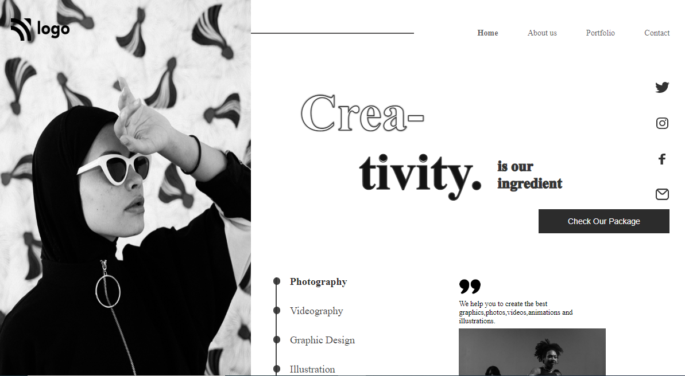

<!-- Social Links -->

[![LinkedIn][linkedin-shield]][linkedin-url]
[![Instagram][instagram-shield]][instagram-url]
[![Hashnode][hashnode-shield]][hashnode-url]

>

> # All About `Project 14` 😎

# **Gained expertise through this project :**

- I have learned how to give webkit style of CSS

- Also learnt more about position.

># Designed With 😇
>## TECHNOLOGIES USED 
>

>## Making Use of Tools
>
>
>
>
>

# Reminder 😮

>## I spent roughly around 3  hours finishing this project. The most of my time was focused on CSS Portion. And this is a `Responsive Design`.

# HERE IS THE PREVIEW HOW THIS PROJECT LOOKS😍
># [LIVE [HOSTED] PROJECT LINK](https://brijesh8128-live-class-project-14.netlify.app/ "Project-14-Netlify")
>

>## For any query you can reach out at brijeshvadaliya1@gmail.com I am happy to help 😎

# HAPPY LEARNING 🤩
>
>## Hey! It compiles! Ship it!

<!-- Linkedin -->

[linkedin-shield]: https://img.shields.io/badge/-LinkedIn-black.svg?style=for-the-badge&logo=linkedin&colorB=0B5FBB
[linkedin-url]: https://www.linkedin.com/in/brijesh-vadaliya-16b3a2202/

<!-- Instagram -->

[instagram-shield]: https://img.shields.io/badge/Instagram-%23E4405F.svg?style=for-the-badge&logo=Instagram&logoColor=white
[instagram-url]: https://www.instagram.com/brijesh_vadaliya_8128/

<!-- Hashnode -->

[hashnode-shield]: https://img.shields.io/badge/Hashnode-2962FF?style=for-the-badge&logo=hashnode&logoColor=white
[hashnode-url]: https://brijeshvadaliya8128.hashnode.dev/

<!-- Project screenshot -->

[product-screenshot]: /readme_assets/project01.jpg
[project-url]: https://trending25.netlify.app/
